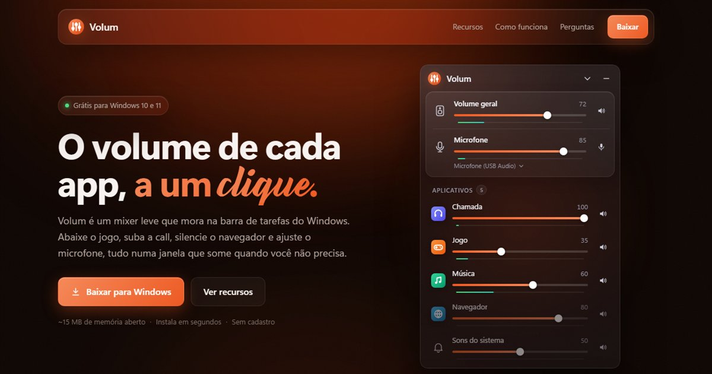

# Volum

O volume de cada app, a um clique. Volum é um mixer de volume leve para Windows que fica na bandeja do sistema e só aparece quando você clica no ícone.

**[Site](https://esdrasstm.github.io/Volum/)** · **[Baixar para Windows](https://github.com/esdrasstm/Volum/releases/latest/download/Volum-win-Setup.exe)** · **[Todas as versões](https://github.com/esdrasstm/Volum/releases)**

## O que ele faz
- Mostra todos os apps que estão tocando som, com ícone, volume, mute e medidor de nível ao vivo
- Volume geral, sons do sistema e microfone (ganho, medidor e troca do microfone padrão)
- Visual em vidro (acrílico do Windows 11), temas claro, escuro ou seguindo o Windows
- **Modo leve**: desliga efeitos e animações e libera a memória quando o mixer fecha
- Abre junto com o Windows e se atualiza sozinho
- Em português, inglês e espanhol

## Instalar
1. Baixe o [`Volum-win-Setup.exe`](https://github.com/esdrasstm/Volum/releases/latest/download/Volum-win-Setup.exe) e abra.
2. O Windows pode mostrar o aviso do **SmartScreen** ("O Windows protegeu o computador"), porque o instalador ainda não tem assinatura digital. Clique em **Mais informações** → **Executar assim mesmo**.
3. Pronto: o ícone aparece na bandeja, perto do relógio. As atualizações chegam sozinhas.

Requisitos: Windows 10 ou 11 com o WebView2 Runtime (já vem no Windows 11).

## Como funciona
A lógica fica em C# (WinForms + WebView2) e a interface é HTML/CSS/JS, para o visual ser fácil de personalizar.

| Arquivo | Papel |
|---|---|
| `LeveMixerWeb/AudioService.cs` | Áudio (NAudio / Core Audio do Windows) |
| `LeveMixerWeb/MixerForm.cs` | Janela sem borda com WebView2 e ponte C# ⇄ JS |
| `LeveMixerWeb/TrayController.cs` | Ícone e menu da bandeja |
| `LeveMixerWeb/Updater.cs` | Atualização automática (Velopack + GitHub Releases) |
| `LeveMixerWeb/wwwroot/` | Interface: `index.html`, `style.css`, `app.js` |
| `site/` | Site do Volum (GitHub Pages) |

## Compilar
Precisa do [.NET 8 SDK](https://dotnet.microsoft.com/download/dotnet/8.0).

    cd LeveMixerWeb
    dotnet run -c Release

**Modo desenvolvedor** (`dotnet run -c Release -- --dev`, ou o `preview.cmd`): F12 abre o DevTools, o mixer abre ao iniciar e não fecha ao perder o foco, e a interface recarrega sozinha ao salvar qualquer arquivo da `wwwroot/`.

## Contribuir
Ideias e correções são bem-vindas: abra uma [issue](https://github.com/esdrasstm/Volum/issues) ou um pull request. Para mudar o visual, quase tudo está em `LeveMixerWeb/wwwroot/style.css` (cores em variáveis no topo).

## Licença
[MIT](LICENSE). Usa [NAudio](https://github.com/naudio/NAudio), [WebView2](https://developer.microsoft.com/microsoft-edge/webview2/) e [Velopack](https://velopack.io/).
